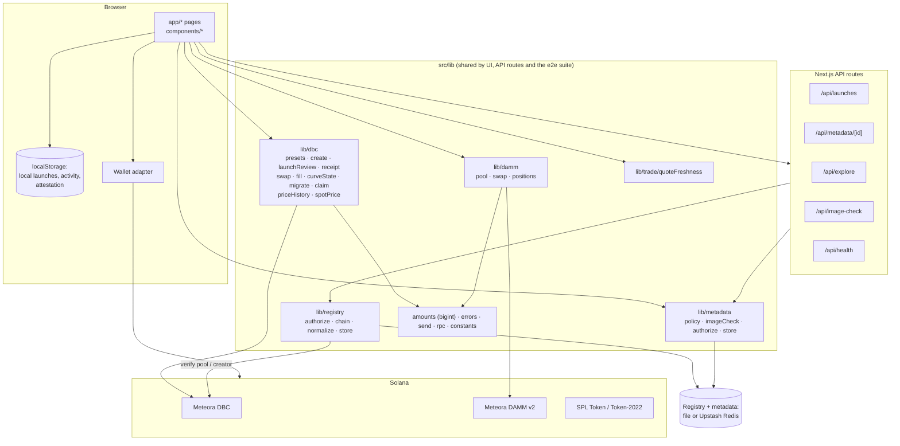

# EquiCurve architecture

EquiCurve is an issuer-controlled launch and price-discovery interface for equity-inspired and RWA-related tokens. It is a Next.js app with no on-chain program of its own: every on-chain action is a transaction to **Meteora Dynamic Bonding Curve (DBC)** or **Meteora DAMM v2**, built with the official SDKs and signed by the user's wallet. The server keeps only an off-chain registry and hosted metadata JSON.

Legal representation (shareholder rights) and RWA verification (custody, audits, redemption) are **outside** this system. See the three-layer explainer in the [README](../README.md#what-equicurve-is-and-is-not-three-separate-layers).

## Lifecycle

```mermaid
flowchart LR
    subgraph Create["1 · Create (issuer wallet)"]
        W[Wizard: basics, offering,<br/>preset, fees, LP lock] --> RV[Review screen:<br/>every on-chain setting]
        RV --> TX1["createConfigAndPool<br/>(+ optional first buy)"]
        TX1 --> RC[Launch receipt:<br/>confirmed / pending / estimate]
        RC --> REG["POST /api/launches<br/>(signed, chain-verified)"]
    end
    subgraph Curve["2 · DBC trading (any wallet)"]
        Q[Quote from pool state<br/>+ chain decimals] --> PS[Pre-sign summary<br/>re-quote if > 15s / state changed]
        PS --> SW["swap / swap2<br/>ExactIn or PartialFill"]
        SW --> Q
    end
    subgraph Grad["3 · Threshold"]
        TH{"quoteReserve ≥<br/>migrationQuoteThreshold?"}
    end
    subgraph Mig["4 · Migrate (permissionless)"]
        M["migrateToDammV2"] --> V[Fetch DAMM v2 pool account<br/>→ verified]
    end
    subgraph Damm["5 · DAMM v2"]
        DS["cp-amm getQuote2 / swap2"]
    end
    subgraph Claims["6 · Claims"]
        C1["claimCreatorTradingFee<br/>claimPartnerTradingFee (DBC)"]
        C2["claimPositionFee2<br/>(DAMM v2 LP positions)"]
    end
    REG --> Q
    SW --> TH
    TH -- no --> Q
    TH -- yes --> M
    V --> DS
    SW -. trading fees .-> C1
    DS -. LP fees .-> C2
```

State shown to users at each stage:

| Stage | Source of truth | UI state labels |
| --- | --- | --- |
| Create | Transaction confirmations + `fetchPoolSnapshot` after send | receipt items: `estimate` (derived before send) → `pending` (submitted) → `confirmed` (read back) / `failed` |
| Registry | `GET /api/launches` | `verified: true` only when the creator signature matched the on-chain creator **and** a chain read succeeded |
| DBC trading | pool + config accounts | quote age, `exact_in` / `partial_fill`, minimum output |
| Threshold | `quoteReserve`, `migrationQuoteThreshold` (`graduationNumbers`) | exact remaining in quote units, or **unknown** when a read fails |
| Migrate | tx confirmation + DAMM v2 account fetch | `not_eligible → eligible → submitted → confirmed → destination_verified` |
| DAMM v2 | DAMM pool account | *expected (derived)* until fetched, then *verified* |

## Component map

| Area | Files | Responsibility |
| --- | --- | --- |
| Presets | `lib/dbc/presets.ts` | Five curve presets with **quote-unit** market caps per quote (SOL / USDC), fee schedules, `launchPresetOverrides` (the one mapping from wizard state to SDK config), fee split (`tradingFeeSplit`), thresholds. |
| Create | `lib/dbc/create.ts`, `lib/dbc/launchReview.ts`, `lib/dbc/receipt.ts`, `components/create/*` | Build the create tx(s); the review screen is built from the **same** config builder so what you review is what you sign; receipt state per item. |
| Curve trading | `lib/dbc/swap.ts`, `lib/dbc/fill.ts`, `lib/trade/quoteFreshness.ts`, `components/TradePanel.tsx`, `components/trade/SwapReview.tsx` | Quote from a single pool-state read, decimals read from both mints, `planBuy` picks ExactIn vs PartialFill so a buy larger than the remaining curve does not fail with DBC 6033; re-quote before signing if stale. |
| Graduation | `lib/dbc/curveState.ts`, `lib/dbc/migrate.ts`, `components/offering/GraduationCard.tsx`, `components/GraduatePanel.tsx` | Exact threshold math in bigint, eligibility, migration tx, destination verification. |
| DAMM v2 | `lib/damm/*`, `components/offering/DammTicket.tsx` | Resolve pool, quote and build from the same pool state, position fee claims. |
| Claims | `lib/dbc/claim.ts`, `components/issuer/*` | Creator / partner trading-fee claims with wallet checks before signing. |
| Registry | `lib/registry/*`, `app/api/launches` | Signed register, server-side chain verification, `verified` flag, file or Upstash store. |
| Metadata | `lib/metadata/*`, `lib/server/imageCheck.ts`, `app/api/metadata/[id]`, `app/api/image-check` | Hosted JSON; name/symbol immutable after launch; signed edits of description/image/links; https image check with SSRF guard. |
| Explore | `lib/explore/*`, `app/api/explore` | Registry + local launches, per-offering verification state, never invents pools. |
| Prices | `lib/dbc/priceHistory.ts`, `lib/dbc/spotPrice.ts`, `lib/amounts.ts`, `components/offering/PriceHistoryChart.tsx` | Swap-derived points and spot price computed from atoms with bigint math; theoretical curve drawn separately. |
| Portfolio | `lib/portfolio.ts`, `app/portfolio` | On-chain token balances vs locally recorded activity. |
| Positioning | `lib/positioning.ts`, `components/trust/PositioningExplainer.tsx`, `components/issuer/IssuerAnswers.tsx` | Single source for positioning copy and issuer answers. |
| E2E | `scripts/e2e-devnet.ts`, `scripts/e2e/*` | Drives the same `src/lib` functions against devnet or a localnet with cloned Meteora programs. |

## Trust boundaries

1. **Wallet → chain**: all value moves are user-signed transactions to Meteora programs. EquiCurve never holds keys or funds.
2. **Server**: can list or withhold registry rows and host metadata. It cannot move funds, and it marks a row `verified` only after reading the pool on-chain and matching the signer to the on-chain creator.
3. **RPC**: trusted for reads; failures surface as *unknown* rather than defaults.
4. **Off-chain claims** (issuer attestation, legal rights, asset custody) are not verified by EquiCurve.
